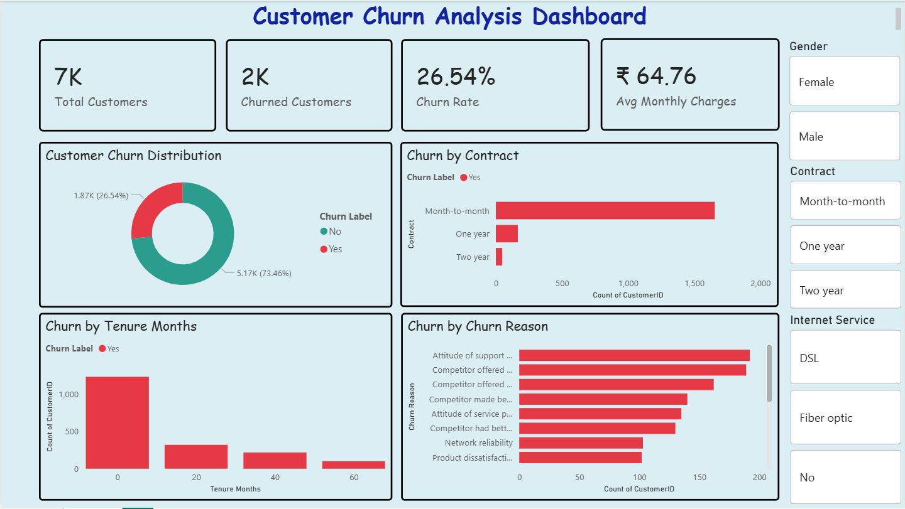

# Customer Churn Analysis Dashboard

## Project Overview
This project analyzes customer churn using SQL and Power BI. The goal is to identify key churn drivers, calculate KPIs, and visualize customer behavior for actionable insights.

## Tools Used
- **SQL**: For data exploration, aggregation, and KPI calculation.
- **Power BI**: For building an interactive dashboard with visual insights.

## Dataset
- Customer churn dataset (Telco dataset)
- Includes customer demographics, service usage, contract details, and churn labels.

## Features
- **KPI Cards**: Total Customers, Churned Customers, Churn Rate, Average Monthly Charges
- **Charts**:
  - Churn Distribution (Donut Chart)
  - Churn by Tenure (Bar Chart)
  - Churn by Contract (Bar Chart)
  - Top Churn Reasons (Bar Chart)
- **Slicers / Filters**: Gender, Contract Type, Internet Service

## SQL Analysis
- Total customers and churned customers
- Churn rate calculation
- Average monthly charges
- Churn breakdown by contract, tenure, and reasons
- Window function used for percentage contribution of churn reasons

## Visualization
Below is the dashboard screenshot showcasing the analysis:

## How to Use
1. SQL queries are available in `churn_analysis.sql`.
2. Dataset can be imported to Power BI to recreate the dashboard.
3. Dashboard is interactive with filters for deeper insights.

## Key Takeaways
- Identified top churn reasons and tenure groups at higher risk.
- Measured churn KPIs to help business decisions.
- Demonstrated end-to-end workflow: SQL analysis → Power BI visualization.